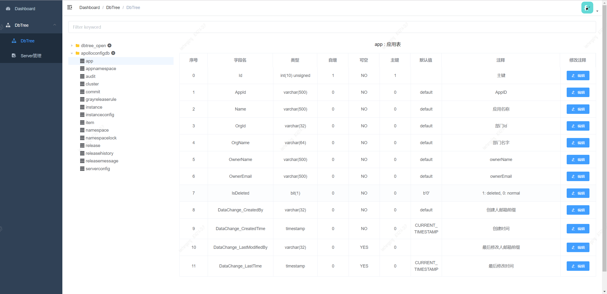
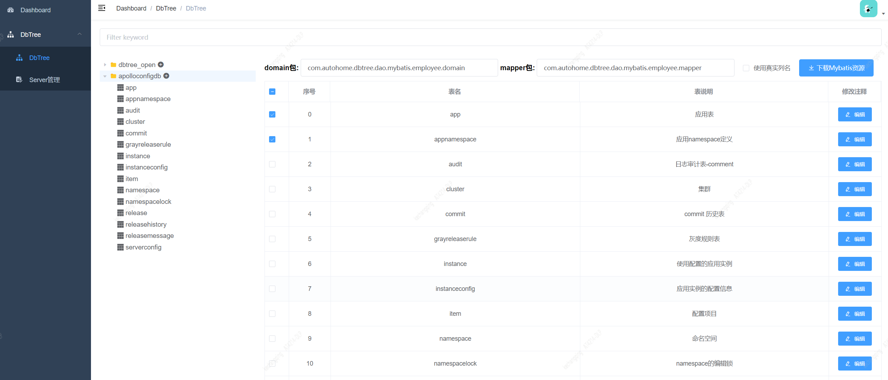
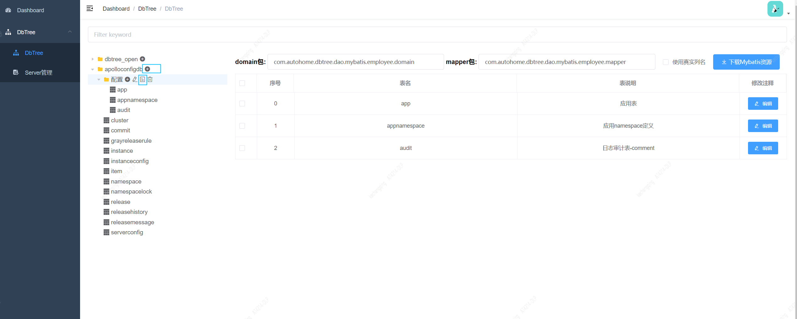
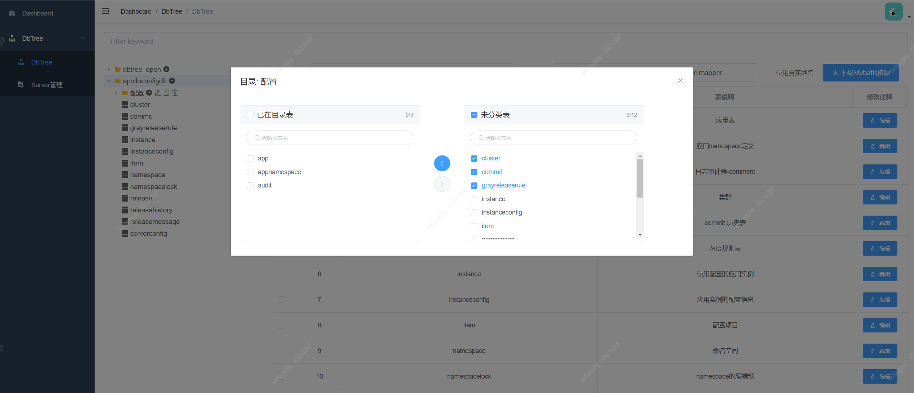

## DBTree简介

简体中文 | [English](./README-EN.md)

DBTree是一个WEB版的轻量数据库表结构查看及管理工具，相比phpMyAdmin, DBTree只专注于方便开发查看表结构信息和
注释维护。通过树形展示库表结构，可以对表进行自定义归类，在线更新注释。你还可以使用它来部分替代mybatis generator的代码生成
功能。

## Features

* 一键生成下载mybatis资源
* 对表进行目录分类
* 展示表常用信息
* 分表只展示其中一个表结构
* 在线维护表注释，字段注释
* 支持mysql, sqlserver
* 表结构导出markdown文档

## 功能截图

* 树形展示表信息，可编辑注释



* 选择目录，勾选表，生成mybatis资源



* 添加分类目录，对表进行归档





## 功能演示


## 为何写这个小工具

在不断的迭代过程中，数据库是开发之间沟通非常频繁且重要的一个环节，我们发现无论是mss management studio，phpMyAdmin这类数据库客户端还是
类似Power Designer的数据库设计软件对表信息共享，注释维护这两个需求来说用起来都非常不便利，尤其是有上千个分表的时候，客户端用起来还是非常难受的。
所以写了这个网页小工具，希望对有同样需求的人有所帮助。  

还有一个很酷的功能，就是你可以选择表，然后一键生成下载mybatis资源文件的功能，非常方便，不用配置mybatis generator配置文件。

## 配置修改

* 服务器配置

dbtree-backend/src/main/resources/dbconfig/db-server.json
```json
{
  "mysql-127.0.0.1": {
    "db_type": "mysql",
    "host": "127.0.0.1",
    "port": 3306,
    "user": "root",
    "password": "123456"
  },
  "sqlserver-127.0.0.2": {
    "db_type": "sqlserver",
    "host": "127.0.0.2",
    "port": 1433,
    "user": "root",
    "password":"123456"
  }
}
```
密码是明文配置

* 数据库配置

dbtree-backend/src/main/resources/dbconfig/db-config.json
```json
{
  "db_1": {
    "db_name": "db_1",
    "db_server": "mysql-127.0.0.1",
    "split_table_rules": [
      {
        "delegate_table": "rule",
        "table_pattern": "rule_%"
      }
    ]
  },
  "db_2": {
     "db_name": "db_2",
     "db_server": "sqlserver-127.0.0.2"
  }
}
```
db-config.json配置文件内容是map结构的json数据，其中key必须和库名(db_name)一致。split_table_rules是指定分表策略，例子的意思是用 rule 代替所有rule_%的表。

* mybatis.base.folder

mybatis生成文件存放目录。

* mybatis.mysql.connector

mysql jdbc jar包位置, 用于配置mybatis generator core的mysql classpathEntry。

* mybatis.sqlserver.connector

sqlserver jdbc jar包位置, 用于配置mybatis generator core的SQL Server classpathEntry。

## 表结构语句

mysql表创建语句见：dbtree-backend/doc/schema目录

## 数据库连接配置

自行修改配置文件中的数据库服务器地址，和用户名, 密码，密码使用druid默认加密。

## 开发调试

环境要求
* jdk 1.8+
* node.js

打开项目运行，访问：http://localhost:8080 

为了更好的开发体验，你应该单独使用VS Code打开dbtree-vue目录，进行调试。执行如下命令:

```bash
# install dependency
npm install

# 建议不要直接使用 cnpm 安装以来，会有各种诡异的 bug。可以通过如下操作解决 npm 下载速度慢的问题
npm install --registry=https://registry.npm.taobao.org

# develop
npm run dev
```

会自动打开： http://localhost:9528

## 部署

JDK使用1.8

项目使用 springboot2.x + vue-element-template + mybatis。dbtree-vue资源会打包进dbtree-backend/src/main/resources/public下。直接部署
dbtree-backend/target/dbtree-{version}.jar就可以了。  

打包后会自动生成dbtree-backend/target/dbtree-{version}.zip文件，将包上传到服务器上，解压后，已经写好启动脚本，端口改为自己的即可。

```bash
# start
scripts/startup.sh

# stop
scripts/shutdown.sh

```

这个工具主要给开发人员使用，部署到测试就可以了，没必要部署到线上，也不安全。


## 致谢

- [vue-admin-template](https://github.com/PanJiaChen/vue-admin-template)


